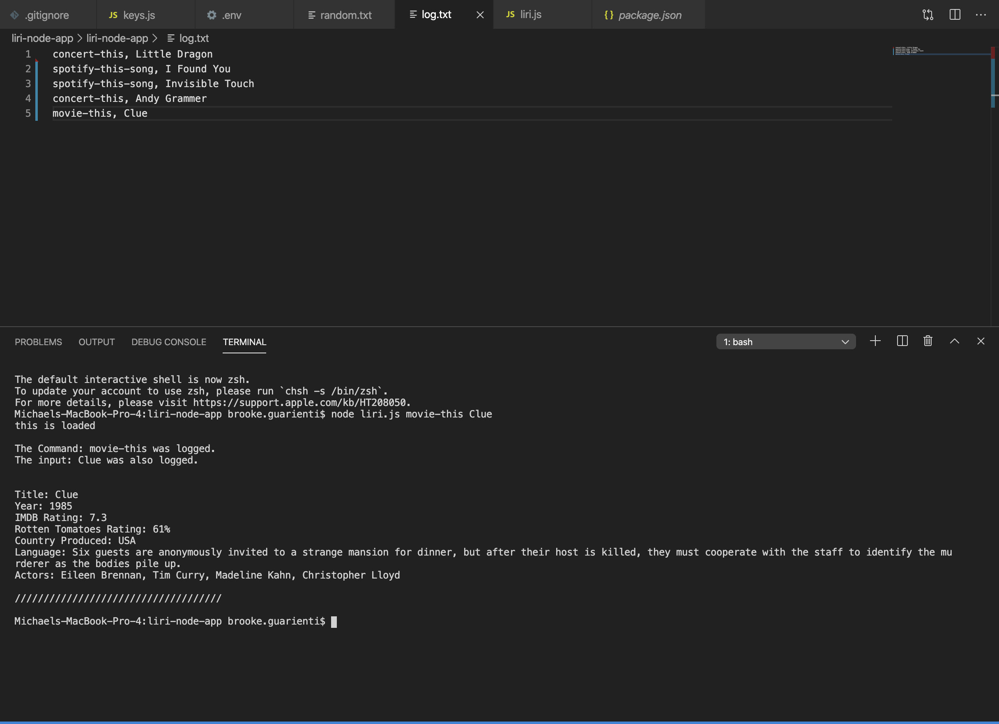

# liri-node-app
Language Interpretation and Recognition Interface Node Application 

The liri-node-app is able to quickly pull data for songs, concerts, and movies using commands and user search input.

## Commands
#### Concert
Using the Bands in Town API, a user is able to search for upcoming concerts based on the artist they search input
  
#### Spotify
Using the Spotify API, a user is able to search by song title to find the following information:
- Artist name
- Album name
- Providing a preview link to the song
      
#### Movie
Using the OMDB API, a user is able to search by movie title to find the following information:
- Year released
- IMDB Rating
- Rotten Tomatoes Rating
- Country Produced
- Language
- Plot
- Actors

## Organization of the app
The liri-node-app consists of the following files:
- liri.js
- keys.js
- random.txt
- log.txt
- package.json 
- package-lock.json
- .gitignore
- .env
- node_modules
- screenshots

## Instructions to run the app
1. Open terminal and navigate to the liri.js file

   Note: "The Command: " and "The Input: " are console logged, as we see later that these logs are added to the log.txt file

2. Enter the following to find a concert for an artist of your choice

    ```node liri.js concert-this < artist name >```

    
    
3. Enter the following to find song information of your choice

    ```node liri.js spotify-this-song < song title >```

    
    
4. Enter the following to find movie information 

    ```node liri.js movie-this < movie title >```

    
    
5. Enter the following to show what is in the ```random.txt``` file
    
    ```node liri.js do-what-it-says```

    


6. If no command is entered, the default will display _"Please submit a valid request"_

    ```node liri.js```

    

7. As commands and input are entered, they are logged in the ```log.txt``` file

    


## Technologies used
* JavaScript
* Nodejs
* Node Packages:
    * Axios
    * Dotenv
    * Moment
    * Node-Spotify-API
* APIs:
    * Bands in Town 
    * OMDB
* Git
* GitHub

## Author
Brooke Guarienti

#### Collaborated with 
* John Pendergrass 
* Amy Haerr 
* Zach Ledford
* Haylee McLemore
